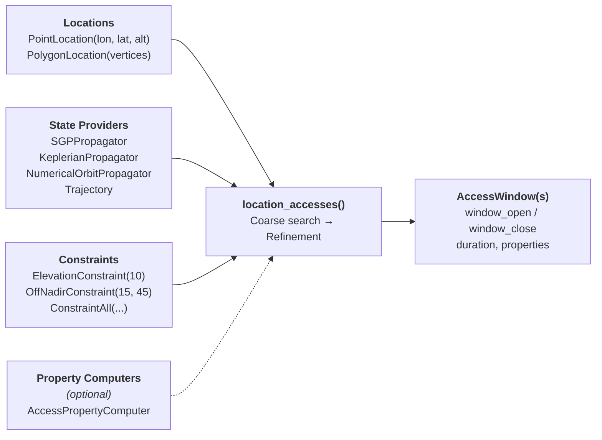
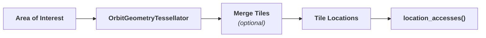

# Access Computation

Access computation determines when and under what conditions satellites can view, observe, or "access" ground locations. Access opportunities are at the core of ground station contact scheduling, imaging opportunity planning, and other mission operations planning tasks.

An **access** occurs when a satellite has a clear geometric line-of-sight to a ground location and meets all constraints (e.g., minimum elevation angle, local time of day, look direction). Brahe's access computation system identifies time windows where all constraints are met and computes relevant properties (e.g., azimuth, elevation, off-nadir angle) for each access window. The system is designed to be flexible, allowing users to define custom locations, constraints, and properties as needed. Access computation is also parallelized by default to efficiently handle large numbers of locations and satellites.

## Pipeline at a Glance

The primary entry point is `location_accesses()`, which takes locations, state providers, a time window, and constraints, then returns a list of `AccessWindow` objects. Property computers are optional — if provided, they calculate additional per-window metrics during the search.

For imaging workflows, a **tessellation** step precedes the pipeline to convert large polygon regions into satellite-aligned tiles:

## System Architecture

Brahe's access computation system is built around four major components:

### 1. Locations

**Locations** define _where_ to check for access. Brahe supports two primary location types:

- **`PointLocation`** - Single geodetic point (e.g., ground station, city)
- **`PolygonLocation`** - Closed polygon area (e.g., imaging region, coverage zone)

Both implement the `AccessibleLocation` trait, which provides coordinate access, property management, and GeoJSON import/export capabilities. Locations can be created from coordinates or loaded from GeoJSON files, and the type supports custom properties for metadata storage.

[Learn more about Locations →](locations.md)

### 2. Constraints

**Constraints** define _what conditions_ must be satisfied for an access to occur. Brahe provides several built-in constraint types including:

- **`ElevationConstraint`** - Minimum/maximum elevation above horizon
- **`ElevationMaskConstraint`** - Azimuth-dependent elevation masks (terrain profiles)
- **`OffNadirConstraint`** - Minimum/maximum off-nadir angle (imaging satellites)
- **`LocalTimeConstraint`** - Local solar time windows (e.g., daylight imaging)
- **`LookDirectionConstraint`** - Left/right/either relative to velocity vector
- **`AscDscConstraint`** - Ascending/descending pass filter

Constraints can be combined using the `ConstraintComposite` system to express sophisticated requirements like "elevation > 10° AND (daylight OR look-right)". Python users can create custom constraints by implementing the `AccessConstraintComputer` interface.

[Learn more about Constraints →](constraints.md)

### 3. Properties

**Properties** define _what information_ to compute during each access window. Brahe automatically computes six core geometric properties:

- `azimuth_open`, `azimuth_close` - Azimuth angles at window start/end
- `elevation_min`, `elevation_max` - Minimum/maximum elevation during access
- `off_nadir_min`, `off_nadir_max` - Minimum/maximum off-nadir angle
- `local_time` - Local solar time at access midpoint
- `look_direction` - Satellite look direction (Left/Right)
- `asc_dsc` - Pass type (Ascending/Descending)

Properties are stored as `PropertyValue` enums supporting scalar, vector, time-series, boolean, string, and JSON data types. Users can add custom properties or implement `AccessPropertyComputer` for automated property calculation during access searches.

[Learn more about Properties →](properties.md)

### 4. Computation

**Computation** is the algorithm that ties everything together. The primary function `location_accesses()` performs a two-phase search:

1. **Coarse search** - Evaluate access at regular time steps to identify candidate windows
2. **Refinement** - Use binary search to precisely locate window boundaries

The `AccessSearchConfig` struct controls algorithm behavior (initial time step, adaptive stepping, etc.) for optimal performance across different scenarios. Results are returned as `AccessWindow` objects containing start/end times, identifiers, and computed properties.

[Learn more about Computation →](computation.md)

### 5. Tessellation

**Tessellation** divides geographic areas of interest into rectangular tiles aligned with satellite ground tracks. The `OrbitGeometryTessellator` uses orbital mechanics to compute along-track and cross-track directions, then tiles the target area into strips suitable for imaging collection planning. Multiple spacecraft with similar orbits can have their tiles merged via `tile_merge_orbit_geometry` to reduce redundancy.

[Learn more about Tessellation →](tessellation.md)

---

## See Also

- [Locations](locations.md) - Ground location types and GeoJSON support
- [Constraints](constraints.md) - Built-in and custom constraint types
- [Computation](computation.md) - Access algorithms and property computation
- [Tessellation](tessellation.md) - Dividing areas into satellite imaging tiles
- [Example: Predicting Ground Contacts](../../examples/ground_contacts.md) - Complete ground station example
- [Example: Computing Imaging Opportunities](../../examples/imaging_opportunities.md) - Imaging scenario
- [Example: Tessellation Visualization](../../examples/tessellation_visualization.md) - Visualizing tessellation results
- [API Reference: Access Module](../../library_api/access/index.md) - Complete API documentation
