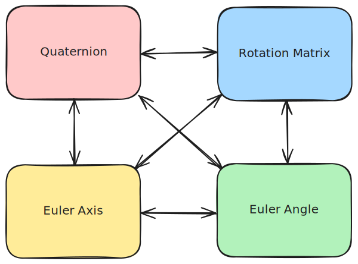
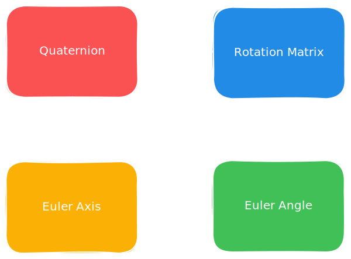

# Attitude Representations

Brahe supports multiple mathematical representations for the attitude, or orientation, of 3D objects such as spacecraft. Each representation has its own advantages and disadvantages depending on the application. These representations are implemented based on the comprehensive treatment found in [Representing Attitude: Euler Angles, Unit Quaternions, and Rotation Vectors](https://www.astro.rug.nl/software/kapteyn-beta/_downloads/attitude.pdf) by James Diebel.

## Overview

Attitude representation is fundamental to spacecraft dynamics and control. Brahe provides four different representations, each with their own advantages:

- **[Quaternions](quaternions.md)**: Singularity-free, compact representation (4 parameters)
- **[Rotation Matrices](rotation_matrices.md)**: Direct transformation matrices (9 parameters)
- **[Euler Angles](euler_angles.md)**: Intuitive angular representation (3 parameters, but with singularities)
- **[Euler Axis](euler_axis.md)**: Axis-angle representation (4 parameters)

## Conversions

Brahe provides functions to convert between all attitude representations. You can initialize an attitude in one representation and convert it to any other one as needed.

    
    

## Choosing a Representation

**Use Quaternions when:**

- Numerical stability is critical
- Interpolating between attitudes
- Propagating attitude dynamics

**Use Rotation Matrices when:**

- Transforming vectors between frames

**Use Euler Angles when:**

- Human readability is important

**Use Euler Axis when:**

- Representing single rotations about an axis

## See Also

- [API Reference - Attitude](../../library_api/attitude/index.md)
