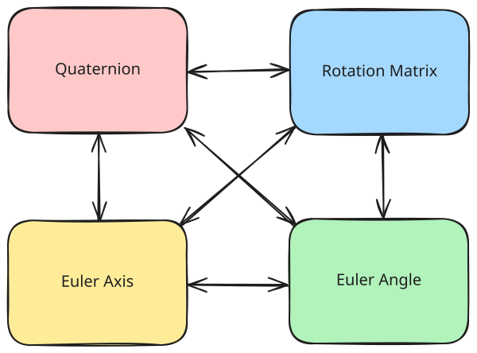
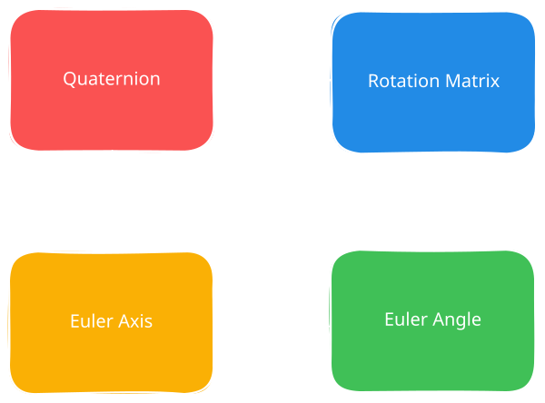

# Attitude Representations

Brahe supports multiple mathematical representations for the attitude, or orientation, of 3D objects such as spacecraft. Each representation has its own advantages and disadvantages depending on the application. These representations are implemented based on the comprehensive treatment found in [Representing Attitude: Euler Angles, Unit Quaternions, and Rotation Vectors](https://www.astro.rug.nl/software/kapteyn-beta/_downloads/attitude.pdf) by James Diebel.

## Overview

Attitude representation is fundamental to spacecraft dynamics and control. Brahe provides four different representations, each with their own advantages:

- **[Quaternions](quaternions.md)**: Singularity-free, compact representation (4 parameters)
- **[Rotation Matrices](rotation_matrices.md)**: Direct transformation matrices (9 parameters)
- **[Euler Angles](euler_angles.md)**: Intuitive angular representation (3 parameters, but with singularities)
- **[Euler Axis](euler_axis.md)**: Axis-angle representation (4 parameters)

## Conversions

Brahe provides functions to convert between all attitude representations. You can initialize an attitude in one representation and convert it to any other one as needed.

    
    

## Choosing a Representation

**Use Quaternions when:**

- Numerical stability is critical
- Interpolating between attitudes
- Propagating attitude dynamics

**Use Rotation Matrices when:**

- Transforming vectors between frames

**Use Euler Angles when:**

- Human readability is important

**Use Euler Axis when:**

- Representing single rotations about an axis

## Attitude Frames

An attitude relates two frames: it is the passive rotation taking vector
components in a source frame A to components in a target frame B. Brahe
models each endpoint with the `AttitudeFrame` type, which distinguishes three
kinds of frame. A `ReferenceFrame` endpoint is any frame the frame
transformation system supports (GCRF, ITRF, EME2000, and the other members of
`ReferenceFrame`) and composes directly with `rotation_frame_to_frame`. An
`OrbitRelative` endpoint is a local orbital frame such as RTN or LVLH, which
is only defined for a given orbit state. A `SpacecraftBodyFrame` is an
object-local frame — a spacecraft body, sensor, or actuator frame — that has
no global definition; it is the frame that attitude data itself defines.

The distinction matters when converting attitude data between
representations: transformations into or out of a `ReferenceFrame` endpoint
can be computed by the frames module, while `SpacecraftBody` endpoints are
carried as labels. CCSDS attitude messages (APM, AEM) declare their frame pair
with these semantics, and brahe's CCSDS module converts between the CCSDS frame
vocabulary and `AttitudeFrame` where a native equivalent exists.

---

## See Also

- [API Reference - Attitude](../../library_api/attitude/index.md)
- [AttitudeFrame](../../library_api/attitude/attitude_frame.md)
